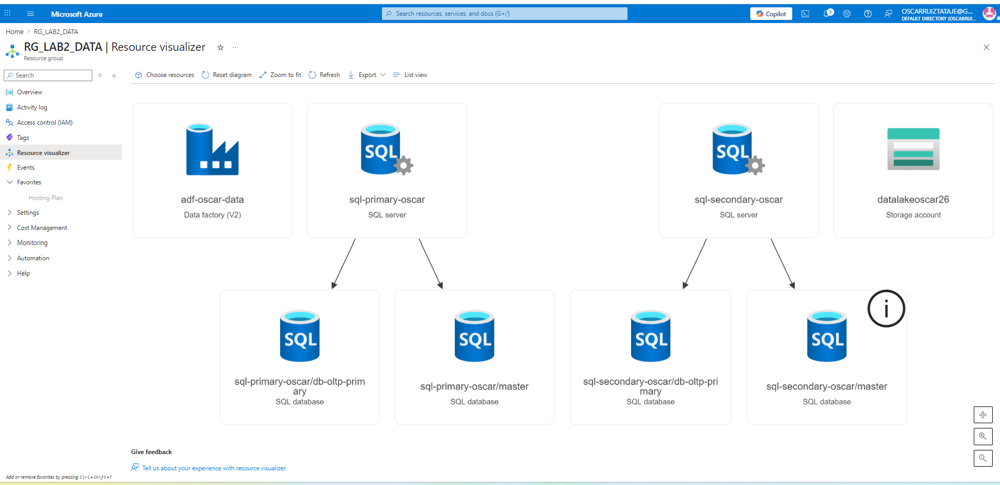
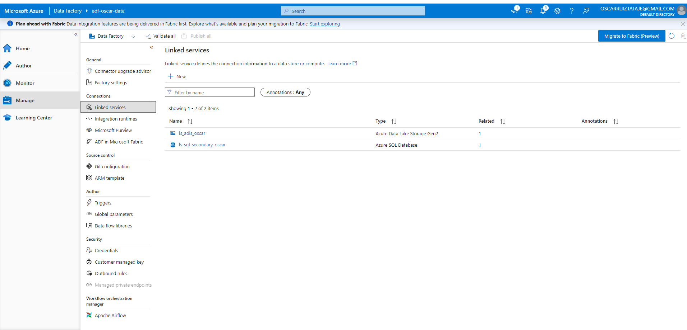
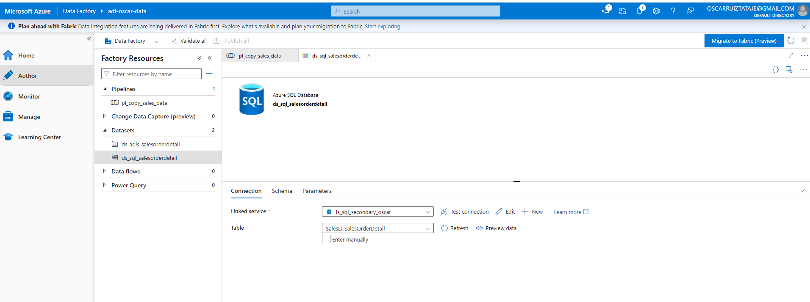
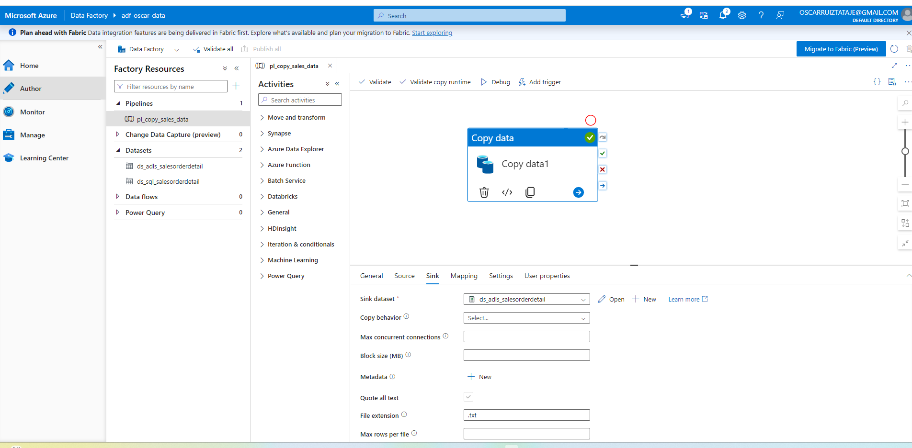
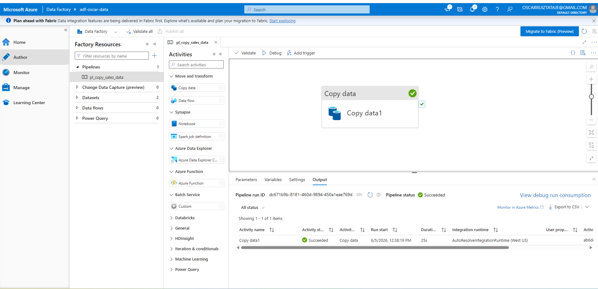
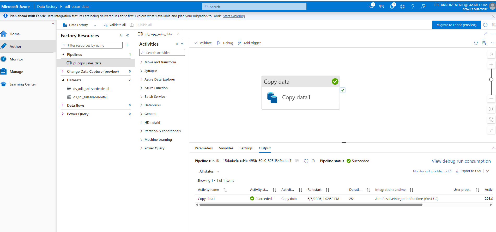
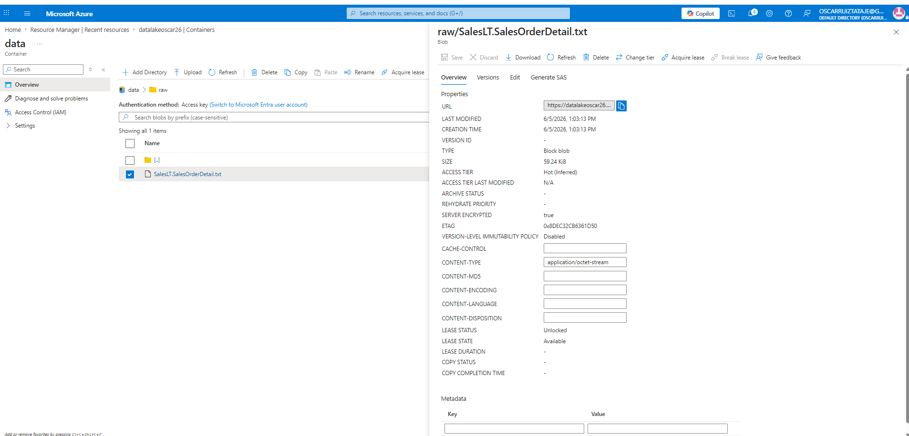

# azure-data-pipeline-lending
# End-to-End Secure Azure Data Ingestion Pipeline

## 🚀 Project Overview
This project demonstrates an enterprise-grade data ingestion architecture using Microsoft Azure. The pipeline securely extracts transactional sales data from an active geo-replicated **Azure SQL Database** (simulating a production environment in `West US 3`) and loads it into an **Azure Data Lake Storage (ADLS) Gen2** account (`West US`) as raw text files using **Azure Data Factory (ADF)**.

---

## 🏗️ Architecture & Resource Provisioning

The cloud infrastructure was built using decoupled, high-availability components organized under a dedicated resource group.

### 1. Resource Group Layout
The entire ecosystem is deployed inside the **`RG_LAB2_DATA`** resource group in the `West US` region. This includes the database cluster components, the storage account landing zone, and the orchestration instance.

*Figure 1: Verified state of the resource group environment containing all compute, storage, and orchestration services (image_892cce.png).*

### 2. Data Factory Creation
The orchestration layer was initiated by creating a **V2 Azure Data Factory** instance named **`adf-oscar-data`** localized to the main `West US` region to match the primary lakehouse storage. 

*Figure 2: Initializing project details and instance parameters in the Azure Portal (image_89f764.png).*

To maintain an agile, manual-deployment structure during this laboratory phase, Git integration was bypassed by selecting the configuration to defer code repository assignment.

*Figure 3: Disabling immediate Git repository configuration to permit direct UI canvas authoring (image_89a165.png).*

*Figure 4: Azure Resource Manager (ARM) verification showing successful provisioning of the Data Factory instance (image_89a187.png).*

---

## 🛠️ Implementation & Connection Security

With the infrastructure live, the project moved into **Azure Data Factory Studio** to link the storage planes.

*Figure 5: Accessing the Authoring and Management workspace panels (image_8921e1.png).*

### 1. Source Database Connection (`ls_sql_secondary_oscar`)
To eliminate compute pressure on the primary database, a connection was established specifically to the secondary read-only replica (`sql-secondary-oscar`) located in `West US 3`. 

*Figure 6: Filtering the ADF data store gallery for Azure SQL Database connectors (image_891dc2.png).*

The connection uses explicit SQL authentication credentials with mandatory network transit encryption layer protocols (`Mandatory`) to satisfy corporate security baselines.

*Figure 7: Complete parameter mapping for the database read-replica credential profile (image_891646.png).*

*Figure 8: Successful handshake verification between the cloud database firewall and ADF (image_8912de.png).*

### 2. Destination Storage Connection (`ls_adls_oscar`)
A second target connector was provisioned to map data directly into the lakehouse structure using native Account Key authentication methods.

*Figure 9: Selecting the Azure Data Lake Storage Gen2 interface model from the gallery (image_7f30fe.png).*

*Figure 10: Successful validation testing for target blob storage authorizations (image_7f2d1d.png).*

---

## 🔀 Pipeline Ingestion Design

A standalone orchestrator pipeline named **`pl_copy_sales_data`** was created using a singular `Copy Data` activity canvas.

*Figure 11: Launching the authoring interface with an unmapped data replication step (image_7f259b.png).*

### 1. Source Data Profiling
The pipeline maps its extraction engine to a localized SQL dataset object named **`ds_sql_salesorderdetail`**, pointing explicitly to the transactional table `SalesLT.SalesOrderDetail`.

*Figure 12: Binding structural database tables to the pipeline ingestion source panel (image_7f215c.png).*

### 2. Sink Target Packaging
The pipeline destination uses a data lake format template mapping down to a file layer layout.

*Figure 13: Preparing the isolated destination dataset parameters from the Sink configuration row (image_7f1677.png).*

The target output is explicitly defined to land inside a landing zone partition system mapped as a schema-headered CSV format payload (`DelimitedText`).
* **Container Directory:** `data`
* **Partition Folder:** `raw`
* **Column Headers:** Enabled (`First row as header`)

*Figure 14: Completed environment matrix showing exact file properties and storage layout (image_7f0f12.png).*

---

## 📊 Pipeline Execution & Target Validation

To execute the data migration workflow, the code assets were compiled and committed globally to the ADF service runtime via the publishing cluster tools.

*Figure 15: Monitoring the active telemetry logs during a real-time system Debug iteration (image_7eb8a2.png).*

Upon hitting the data orchestration runtime engine, the data pipeline fully processed the tables from the remote cluster region into the cloud target file directory system in a matter of seconds without data loss.

### Final Storage Verification
Navigating directly inside the physical **`datalakeoscar26`** containers validates the physical existence of the data asset file package:

* **File Storage Path:** `data/raw/`
* **Generated Asset Name:** `SalesLT.SalesOrderDetail.txt`
* **Asset Payload Weight:** `59.24 KiB`
* **Operational Flow Outcome:** `Succeeded`

*Figure 16: Physical storage directory displaying the safely compiled transaction payload file inside the raw repository lakehouse (image_7eb4fa.png).*
